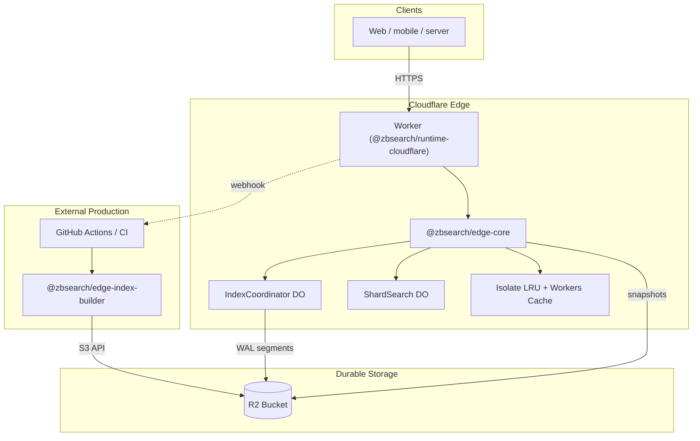
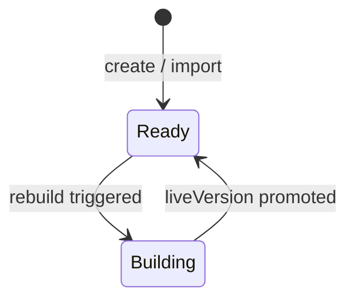

We wanted ZBSearch at the edge: a globally distributed search API without operating our own servers, with the same full-text, vector, and hybrid search you get from the `zbsearch` library.

That became **ZBSearch Edge** - a self-hosted API on **Cloudflare Workers** with **R2** as durable storage. You deploy it to your own account. No control plane, no billing integration, no lock-in beyond standard Cloudflare infrastructure.

## Design constraints

Workers are great for low-latency HTTP, but they have tight CPU/memory limits, no local disk, and billing tied to request duration. R2 is cheap and durable, but every read/write is a network hop.

Those constraints forced a specific shape:

1. **Reads** - load a pre-built snapshot, cache it hard, serve search.
2. **Writes** - append to a log in R2, acknowledge immediately (`202`), merge later.
3. **Heavy work** - full rebuilds belong in CI/CLI, not a 128 MB isolate.
4. **Portability** - Cloudflare is the first runtime, not the only one.

The result: **snapshot + WAL**, coordinated by Durable Objects, with optional sharding for large catalogs.

## Architecture at a glance



| Path | What happens |
| --- | --- |
| **Write** | `IndexCoordinator` batches ops into WAL segments in R2 → `202 Accepted` |
| **Search** | Load live snapshot (3-layer cache); overlay pending WAL when `pendingOps > 0` |
| **Rebuild** | Freeze WAL → merge → upload new immutable snapshot → promote `liveVersion` |
| **Large indexes** | Create with `shards: N`; search fans out to `ShardSearch` DOs |

## Package split

Four published packages (**v3.3.2**). The Cloudflare adapter stays thin; the core stays portable:

| Package | Responsibility |
| --- | --- |
| `@zbsearch/edge-core` | REST router, WAL, rebuild, search (runtime-agnostic) |
| `@zbsearch/runtime-cloudflare` | Worker + Durable Objects, R2/Cache adapters, setup/teardown CLIs |
| `@zbsearch/storage-s3` | S3 driver for R2 (builder CLI) |
| `@zbsearch/edge-index-builder` | CLI for production rebuilds and bulk `import` |

`edge-core` depends only on `zbsearch` and msgpack. Storage and caching are two small interfaces (`ObjectStorage`, `ShardCache`). A future Docker/Lambda/Fly runtime only needs those adapters.

## Two Durable Objects

Default wrangler configs bind both. They are what make the edge deployment production-shaped:

**`IndexCoordinator`** - one DO per physical index. Serializes all WAL appends, assigns sequence numbers, batches ops into sealed segments (~**100 ops or 256 KB**), and holds the rebuild lock (stealable after 15 minutes if a rebuild crashes). Head/meta mutations go through it, so concurrent writers cannot corrupt `head.json`.

**`ShardSearch`** - one DO per physical shard. Group searches fan out here so each shard query runs (and keeps its snapshot cache warm) in its own isolate. That is how total index size escapes the single-isolate **128 MB** ceiling. Without the binding, shard search falls back to in-process fan-out (fine while `shards × snapshot` stays under ~128 MB).

## Write path: WAL segments

```
wal/{indexId}/head.json
wal/{indexId}/segments/0000000001-0000000087_chg_xxx.ndjson
wal/{indexId}/segments/open.ndjson   ← mirror of the unsealed segment
```

Without the coordinator (standalone `edge-core` or the builder CLI), writes fall back to one R2 object per op under `wal/.../entries/`. Existing per-op entries keep working; the first coordinated rebuild consumes both layouts.

Batch API writes (`POST .../documents/batch`) land in a **single segment**, cutting R2 PUTs. The API always returns `202` with a `changeId` - durable immediately, compacted into a snapshot on rebuild.

## Read path: three caches + WAL overlay

Search never re-decodes a snapshot on every request when it can avoid it:

1. **Per-isolate LRU** - fully deserialized ZBSearch DBs (`SNAPSHOT_CACHE_MAX_ENTRIES` default 4, `SNAPSHOT_CACHE_MAX_BYTES` default ~64 MB). Rebuilds change the version key → natural invalidation.
2. **Workers Cache API** - raw snapshot bytes, shared per colo.
3. **R2** - source of truth.

When `pendingOps > 0`, search overlays WAL ops onto snapshot documents in memory and returns `includesBuffer: true`. Keep `pendingOps` near zero in production - dirty searches re-index the shard per request and dominate latency.

## Sharded indexes

Pass `"shards": N` (2–64) on create, or `--shards N` on import. Each physical shard `<id>--shard-<i>` is an ordinary index: own WAL, snapshot, coordinator, rebuild threshold. Documents route by FNV-1a of the doc id - **ids must be stable**.

Implications:

- Group rebuild is **serial** (parallel would OOM the isolate).
- Threshold scheduling is **per shard** (hot shards rebuild more often).
- Shard count is **fixed** - re-shard by re-importing.
- Cross-shard BM25 IDF is approximate; `groupBy` is not merged across shards.

Rule of thumb (~1.3 KB/doc): **25–50k docs per shard** keeps snapshots under the default cache budget. Past ~50k total docs, use `SEARCH_SHARD`.

## Rebuild pipeline



1. Acquire rebuild lock on the coordinator  
2. Freeze WAL (seal open segment, collect pending ops)  
3. Merge snapshot + WAL → new msgpack snapshot  
4. Finalize: delete frozen segments, set `liveVersion`, release lock  

Concurrent writes during rebuild survive as new `pendingOps`.

| Strategy | Best for |
| --- | --- |
| In-Worker cron (`*/5`) | Demos, small catalogs |
| Threshold after write (`REBUILD_THRESHOLD_OPS`) | Near-real-time small indexes |
| `POST /v1/indexes/:id/rebuild` | Controlled batches |
| External CLI / CI (`zbsearch-edge-builder`) | **Production** |

When `BUILDER_WEBHOOK_URL` is set, cron **never** rebuilds inline - it only notifies your runner. In-Worker rebuilds that face a huge one-shot backlog (~10k+ pending ops per shard) can wedge at `building`; use `import` for bulk loads.

```bash
npm install @zbsearch/edge-index-builder@3.3.2
npx zbsearch-edge-builder rebuild --all
```

## Bulk import

Skip the WAL for large catalogs - build the snapshot on a machine with real memory and upload it:

```bash
npx zbsearch-edge-builder import products ./catalog.json \
  --create --name products --schema-file ./schema.json --shards 8
```

Documents are searchable immediately (`liveVersion` set, WAL cleared).

## Deploy and auth

```bash
npm install @zbsearch/runtime-cloudflare@3.3.2 wrangler
npx wrangler login
npx zbsearch-edge-setup --init
```

The setup CLI writes `wrangler.toml`, creates R2 buckets, sets secrets, and deploys. Generated config binds `BUCKET`, `INDEX_COORDINATOR`, and `SEARCH_SHARD`.

| Secret / var | Purpose |
| --- | --- |
| `WRITE_API_KEY` | Full access (reads + writes) |
| `READ_API_KEY` | Searches/status only - safe for public clients |
| `BUILDER_WEBHOOK_URL` | External rebuild trigger |
| `REBUILD_THRESHOLD_OPS` | Default `500` |
| `SNAPSHOT_CACHE_*` | Isolate LRU bounds |

Legacy `API_KEY` still works as full-access. Public: `GET /health`, `GET /v1/info`, `OPTIONS`.

**Workers Paid is required** - Free-plan CPU (10 ms) cannot run search. Paid also unlocks extended CPU for in-Worker rebuilds.

## REST surface

| Method | Path | Behavior |
| --- | --- | --- |
| `POST` | `/v1/indexes` | Create (`shards` optional) |
| `POST`/`PUT`/`DELETE` | `/v1/indexes/:id/documents...` | Buffer write (`202`) |
| `POST` | `/v1/indexes/:id/documents/batch` | Batch buffer (`202`) |
| `POST` | `/v1/indexes/:id/search` | Full-text / vector / hybrid |
| `POST` | `/v1/indexes/:id/rebuild` | Trigger rebuild |
| `GET` | `/v1/indexes/:id/status` | `pendingOps`, `liveVersion`, sizes |

Search params match the `zbsearch` library: `term`, `mode`, `where`, `vector`, `hybridWeights`, facets, and more.

## Tradeoffs we accepted

- **Snapshot + WAL**, not a live mutable index - R2 is object storage; immutable snapshots give predictable reads.
- **Full msgpack snapshots per shard** - simple and correct; sharding is how we scale past one isolate. Binary `.spb`/`.ivf` formats are still future work.
- **Eventual consistency with overlay** - writes are durable immediately; search can see them before rebuild via WAL overlay, but latency suffers until compaction.
- **No control plane** - state lives in R2. Redeploy against the same bucket and you recover.
- **Beta** - index delete does not purge R2 objects; no fine-grained multi-key auth beyond read/write.

## Try it

```bash
npm install @zbsearch/runtime-cloudflare@3.3.2 wrangler
npx wrangler login
npx zbsearch-edge-setup --init
```

For production rebuilds: `@zbsearch/edge-index-builder@3.3.2` → `npx zbsearch-edge-builder rebuild --all` from CI.

See the [Cloudflare docs](/docs/cloudflare), [Indexing & rebuilds](/docs/cloudflare/indexing-and-rebuilds), and [Production](/docs/cloudflare/production) for operational detail.
