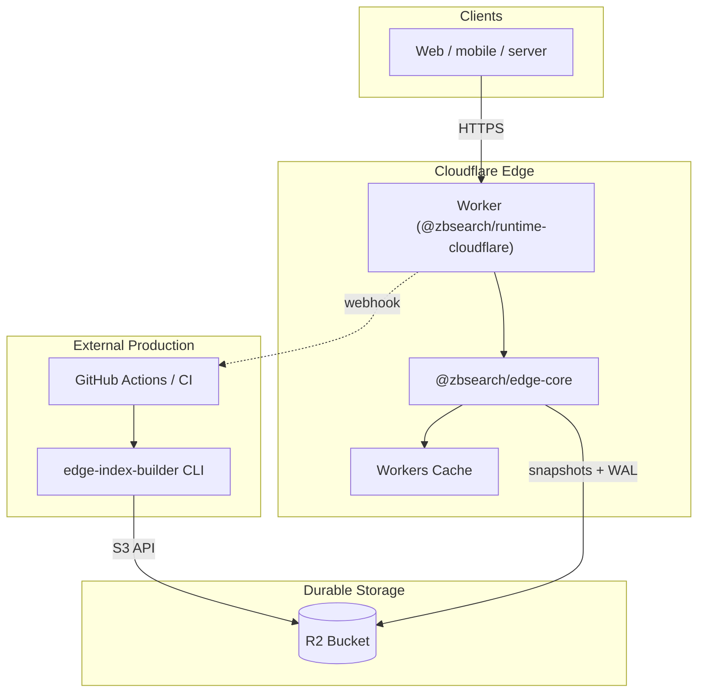
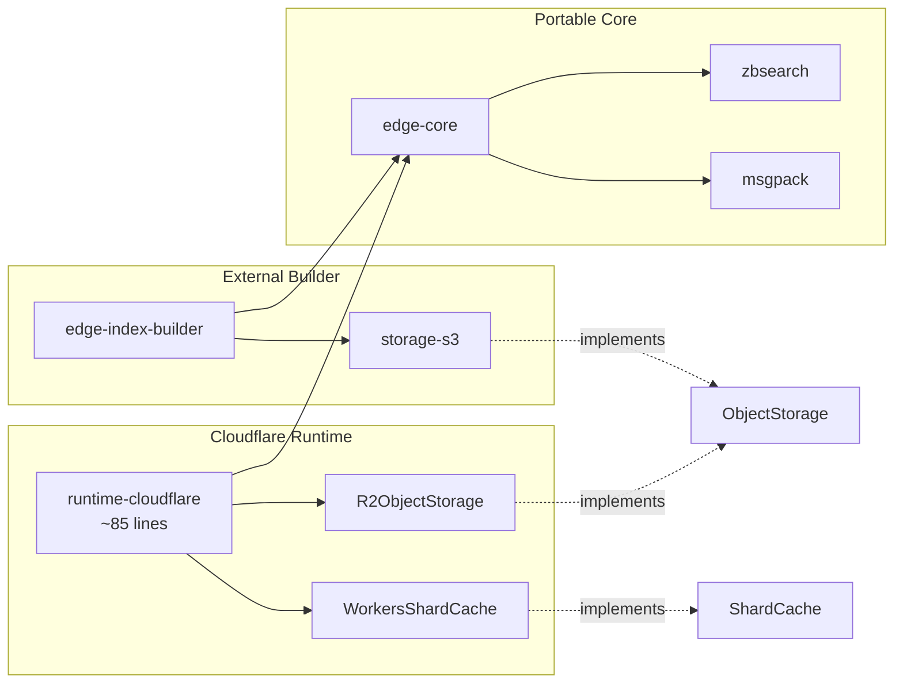
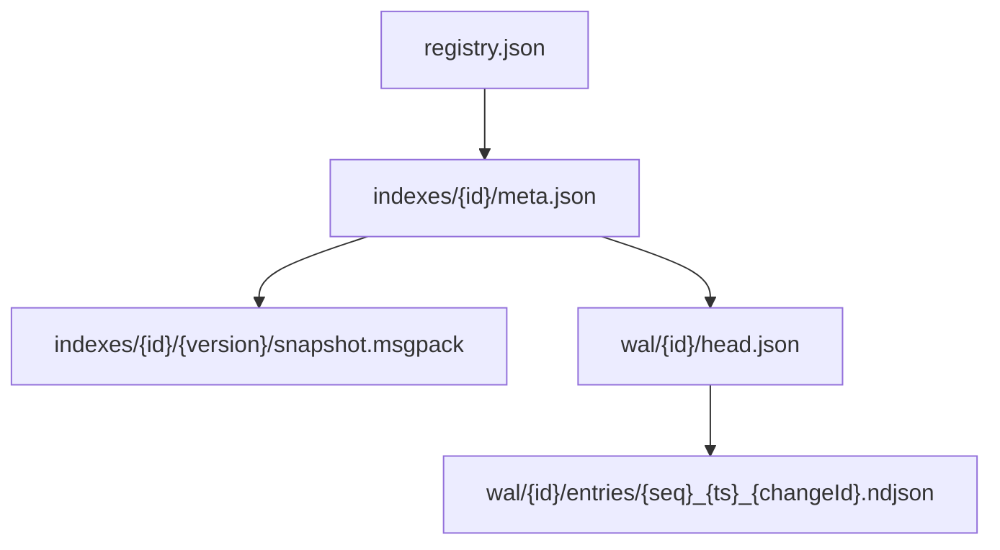
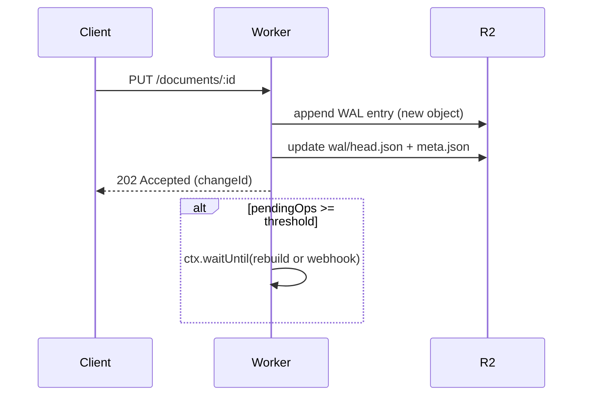
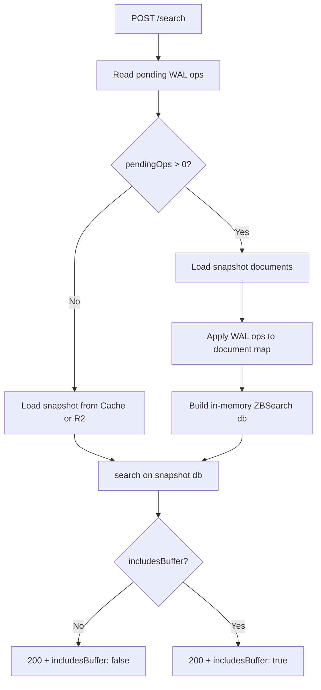
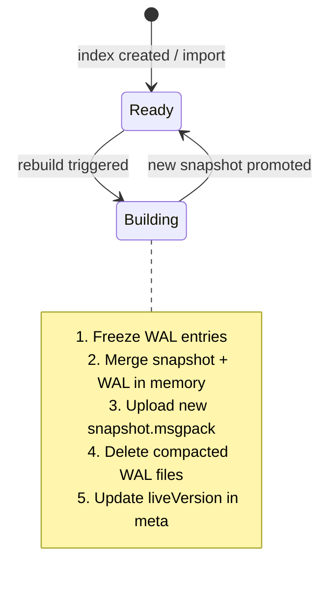
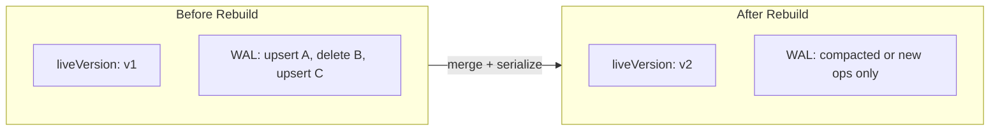
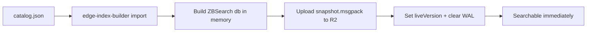
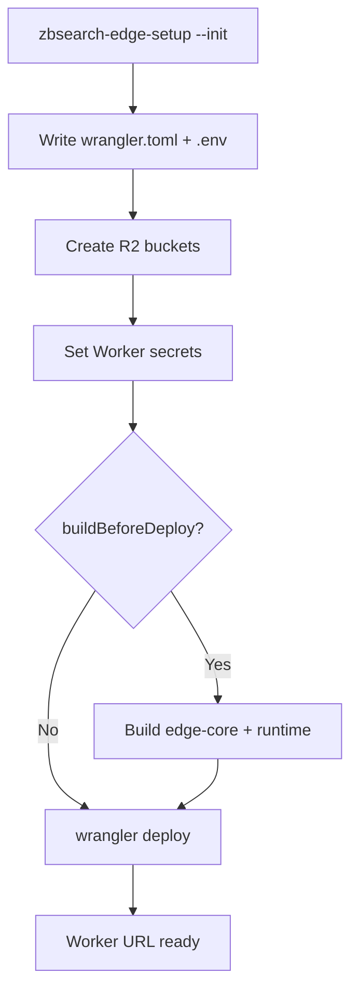

We wanted ZBSearch to run at the edge: a globally distributed search API without operating our own servers, with the same full-text, vector, and hybrid search you get from the `zbsearch` library in the browser or Node.js.

That goal became **ZBSearch Edge**, a self-hosted search API on **Cloudflare Workers** with **R2** as durable storage. You deploy it to your own Cloudflare account. There is no control plane, no billing integration, and no vendor lock-in beyond standard Cloudflare infrastructure.

This post walks through how we designed and implemented it.

## The constraints we designed around

Cloudflare Workers are excellent for low-latency HTTP at the edge, but they are not a general-purpose database host. A Worker has tight CPU and memory limits, no persistent local disk, and billing tied to request duration. R2 gives us cheap, durable object storage with an S3-compatible API, but every read and write is a network round trip.

Those constraints pushed us toward a specific shape:

1. **Reads should be fast and predictable**: load a pre-built index snapshot, cache it at the edge, serve search.
2. **Writes should be cheap and durable**: append operations to a log in R2, acknowledge immediately, merge later.
3. **Heavy work should run outside the Worker**: full index rebuilds belong in CI or a CLI, not in a 128 MB isolate.
4. **The core logic should be portable**: Cloudflare is the first runtime, not the only one we have in mind.

The result is a **snapshot + WAL** architecture with a deliberate package split.

## High-level architecture

At runtime, a single Cloudflare Worker fronts every request. It delegates to `@zbsearch/edge-core` for routing, index management, and search orchestration. Storage and caching are injected through small interfaces implemented for Cloudflare:



**Clients** talk to the Worker over HTTPS. **Search** loads an immutable msgpack snapshot from R2 (cached in Workers Cache). **Writes** append NDJSON operations to an append-only WAL in R2 and return `202 Accepted` immediately. **Rebuilds** merge the live snapshot with pending WAL entries into a new snapshot version.

## Package split: keep the core portable

We split the implementation into four published packages so the Cloudflare adapter stays thin:

| Package | Responsibility |
| --- | --- |
| `@zbsearch/edge-core` | REST router, WAL, rebuild logic, search orchestration (runtime-agnostic) |
| `@zbsearch/runtime-cloudflare` | Workers entrypoint (`fetch`, `scheduled`), R2 + Cache bindings, setup/teardown CLIs |
| `@zbsearch/storage-s3` | S3-compatible storage driver for R2 (used by the builder CLI) |
| `@zbsearch/edge-index-builder` | CLI for production rebuilds and bulk `import` |



`edge-core` depends only on `zbsearch` and `@msgpack/msgpack`. It knows nothing about Cloudflare. The Worker file in `runtime-cloudflare` is roughly 85 lines: wire up `R2ObjectStorage` and `WorkersShardCache`, call `handleRequest`, set CORS headers, and register a cron handler.

This matters because the storage layer is abstracted behind two interfaces:

```ts
// ObjectStorage: durable blobs in R2/S3
interface ObjectStorage {
  get(key: string): Promise<ObjectGetResult | null>
  put(key: string, body: Uint8Array, opts?: { contentType?: string }): Promise<{ etag: string }>
  delete(key: string): Promise<void>
  list(prefix: string): AsyncIterable<{ key: string; size: number }>
}

// ShardCache: hot snapshot bytes at the edge
interface ShardCache {
  get(key: string): Promise<Uint8Array | null>
  set(key: string, body: Uint8Array, ttlSec: number): Promise<void>
  delete(key: string): Promise<void>
}
```

Any future runtime (Docker, AWS Lambda, Fly.io) only needs to implement these two adapters. The REST API, WAL semantics, and rebuild pipeline stay unchanged.

## R2 storage layout

Every index is a directory tree under a single R2 bucket. A top-level `registry.json` lists index IDs; each index has metadata, versioned snapshots, and a WAL:



**`meta.json`** tracks the index schema, settings, `liveVersion` (the current searchable snapshot), `pendingOps` (unmerged WAL count), document counts, and status (`empty`, `ready`, `building`).

**`snapshot.msgpack`** is a serialized ZBSearch database, the same format `save()` and `load()` produce in the library. Snapshots are **immutable**. A rebuild always writes a new version directory and atomically updates `liveVersion` in metadata.

**`wal/{indexId}/head.json`** holds the WAL head: total op count, pending op count, and oldest op timestamp.

**`wal/{indexId}/entries/*.ndjson`** stores append-only WAL files. Each file contains one or more NDJSON lines:

```json
{"op":"upsert","id":"sku-1","ts":"2026-07-10T12:00:00.000Z","doc":{"title":"Headphones","price":99}}
{"op":"delete","id":"sku-2","ts":"2026-07-10T12:01:00.000Z"}
```

Batch writes (`POST /v1/indexes/:id/documents/batch`) pack multiple operations into a **single WAL file**, reducing R2 PUT count compared to one PUT per document.

### Why we moved from in-place segments to append-only WAL

Early versions grew in-place segment files under `buffer/{indexId}/segments/` until they hit 64 MB, then rotated. That pattern requires **read-modify-write** on R2 for every append, which is expensive and contention-prone.

The current design writes **immutable WAL entry files** on every write. No object is ever updated in place. During rebuild, consumed entries are deleted in bulk. Legacy segment paths are still read for migration, but new writes only use the WAL layout.

## Write path: buffer first, merge later

When a client upserts or deletes a document, the Worker does not rebuild the index inline.



The flow in code:

1. Append an operation to a new WAL entry file in R2.
2. Increment `pendingOps` in the WAL head and index metadata.
3. Return `202 Accepted` with a `changeId` and `bufferedAt` timestamp.
4. If `pendingOps` crosses `REBUILD_THRESHOLD_OPS`, schedule a background rebuild or fire a webhook.

```ts
// Simplified from edge-core service.ts
export async function bufferUpsert(storage, indexId, docId, doc) {
  const { changeId, bufferedAt, head } = await appendBufferOp(storage, indexId, {
    op: 'upsert', id: docId, ts: new Date().toISOString(), doc
  })
  meta.pendingOps = head.pendingOps
  await saveIndexMeta(storage, meta)
  return { status: 'buffered', changeId, bufferedAt }
}
```

This write path is intentionally **eventually consistent** at the snapshot level. Rebuilds compact WAL entries into a new `liveVersion`. Until then, search can still see pending writes, as described in the next section.

## Read path: snapshots, overlay, and edge cache

Search requests hit `runSearch()` in `edge-core`, which loads a searchable database through `loadSearchableDb()`:



1. Read pending WAL operations from R2.
2. If there are no pending ops and a `liveVersion` exists, load the snapshot from R2 (or Workers Cache) and deserialize it with `load()`.
3. If there **are** pending ops, load the snapshot's documents into a `Map`, apply WAL operations in order (upserts overwrite, deletes remove), build a fresh in-memory ZBSearch database with `insertMultiple()`, and search that.

The response includes `includesBuffer: true` when pending WAL ops were overlaid at query time, and `includesBuffer: false` when the search ran purely against the compacted snapshot.

```ts
// Search merges snapshot + WAL when pendingOps > 0
const bufferOps = await readPendingBufferOps(storage, meta)
if (bufferOps.length === 0) {
  const db = await loadSnapshotDb(storage, meta, cache)
  return { db, includesBuffer: false }
}
const baseDocs = await loadDocumentsFromSnapshot(storage, meta, cache)
const merged = applyBufferOps(baseDocs, bufferOps)
const db = create({ schema: meta.schema })
insertMultiple(db, [...merged.entries()].map(([id, doc]) => ({ id, ...doc })))
return { db, includesBuffer: true }
```

**Workers Cache** stores snapshot bytes under synthetic cache URLs (`https://zbsearch-edge-cache.invalid/...`) with a one-hour TTL. Hot indexes avoid repeated R2 reads on every search. The cache is a performance layer. R2 remains the source of truth.

The tradeoff is clear: searches against a large index with many pending WAL ops pay the cost of rebuilding an in-memory database per request. That is why rebuilds matter for production throughput, even though correctness does not strictly require them.

## Rebuild pipeline

A rebuild merges snapshot state with pending WAL operations into a new immutable snapshot:





The freeze/compaction model handles concurrent writes: if new WAL entries arrive while a rebuild runs, they survive compaction and remain as `pendingOps` for the next cycle.

Rebuilds can be triggered four ways:

| Strategy | How it works | Best for |
| --- | --- | --- |
| **In-Worker cron** | `scheduled()` lists indexes, rebuilds when `pendingOps >= threshold` | Demos, small catalogs |
| **Threshold after write** | Each buffered write calls `maybeScheduleRebuild()` | Near-real-time small indexes |
| **Manual API** | `POST /v1/indexes/:id/rebuild` | Controlled batch imports |
| **External CLI / CI** | `edge-index-builder rebuild` against R2 via S3 API | Production, large indexes |

For production, we recommend **external rebuilds**. In-Worker rebuilds share the Worker's CPU and memory budget. A multi-hundred-megabyte snapshot can exceed isolate limits. The Worker cron can instead POST to `BUILDER_WEBHOOK_URL`, which triggers GitHub Actions (or any CI) to run:

```bash
node packages/edge-index-builder/dist/cli.js rebuild --all
```

The reference workflow in `deploy/github-actions/zbsearch-rebuild.yml` runs every 15 minutes, on manual dispatch, or via `repository_dispatch` from a webhook relay.

## Bulk import: skip the WAL entirely

For large catalogs, per-document API writes are the wrong tool. The `import` CLI builds a snapshot locally and uploads it directly to R2:

```bash
node packages/edge-index-builder/dist/cli.js import products ./catalog.json \
  --create --name products --schema-file ./schema.json
```



Import:

1. Parses JSON or JSONL input and assigns stable document IDs.
2. Builds a ZBSearch database in memory on the build machine (no Worker CPU limits).
3. Uploads `snapshot.msgpack` to R2.
4. Clears any pending WAL entries and sets `liveVersion`. Documents are searchable immediately.

This path is how we load demo datasets like the unicorns corpus in seconds instead of issuing thousands of HTTP writes.

## The Cloudflare Worker entrypoint

The Worker in `@zbsearch/runtime-cloudflare` is intentionally minimal. On each `fetch`:

```ts
export default {
  async fetch(request, env, ctx) {
    const storage = new R2ObjectStorage(env.BUCKET)
    const cache = new WorkersShardCache(caches.default)

    const response = toResponse(await handleRequest({
      storage,
      cache,
      apiKey: env.API_KEY,
      scheduleBackground: (task) => ctx.waitUntil(task),
      rebuildThresholdOps: Number(env.REBUILD_THRESHOLD_OPS),
      builderWebhookUrl: env.BUILDER_WEBHOOK_URL,
    }, req))

    response.headers.set('access-control-allow-origin', '*')
    return response
  },

  async scheduled(event, env, ctx) {
    // Cron: check every index, schedule rebuild or webhook
    for (const index of await listIndexMetas(storage)) {
      await maybeScheduleRebuild(storage, index.id, { ...options, source: 'scheduler' })
    }
  }
}
```

`ctx.waitUntil()` is the key Workers primitive: rebuilds and webhook calls run after the response is sent, without blocking the client. When `BUILDER_WEBHOOK_URL` is set, the Worker **never** rebuilds inline on cron. It only notifies the external runner.

Environment configuration:

| Binding / secret | Purpose |
| --- | --- |
| `BUCKET` (R2) | Durable storage for snapshots, WAL, metadata |
| `API_KEY` (secret) | Bearer token for `/v1/*` routes |
| `REBUILD_THRESHOLD_OPS` (var) | Pending ops before auto-rebuild or webhook |
| `BUILDER_WEBHOOK_URL` (secret) | External rebuild trigger URL |

Public routes (`GET /health`, `GET /v1/info`, `OPTIONS`) skip authentication.

## Deploy tooling: from npm install to live Worker

We ship setup and teardown as CLIs inside `@zbsearch/runtime-cloudflare` so users never need to clone the monorepo:

```bash
npm install @zbsearch/runtime-cloudflare wrangler
npx wrangler login
npx zbsearch-edge-setup --init
```



`zbsearch-edge-setup` runs an interactive wizard (or reads `zbsearch.edge.config.json`) and:

1. Writes `wrangler.toml` and `.env` (R2 S3 credentials for the builder CLI).
2. Creates R2 buckets (production + preview).
3. Sets Worker secrets (`API_KEY`, `BUILDER_WEBHOOK_URL`).
4. Optionally builds packages and runs `wrangler deploy`.

In the monorepo, the same CLI targets `deploy/cloudflare/` as the generated deploy directory. The setup script detects monorepo layout via `pnpm-workspace.yaml` and points `wrangler.toml` at `packages/runtime-cloudflare/src/worker.ts` with a relative path.

Generated `wrangler.toml` includes:

```toml
[[r2_buckets]]
binding = "BUCKET"
bucket_name = "zbsearch-edge"

[triggers]
crons = ["*/5 * * * *"]

[vars]
REBUILD_THRESHOLD_OPS = "500"
```

Teardown is symmetric: `npx zbsearch-edge-teardown` removes the Worker and optionally deletes R2 buckets.

## REST API surface

`edge-core` implements a versioned REST API routed by pathname matching. No framework, just explicit handlers:

| Method | Path | Behavior |
| --- | --- | --- |
| `POST` | `/v1/indexes` | Create index with schema |
| `POST` | `/v1/indexes/:id/documents` | Buffer upsert (`202`) |
| `PUT` | `/v1/indexes/:id/documents/:docId` | Buffer upsert (`202`) |
| `DELETE` | `/v1/indexes/:id/documents/:docId` | Buffer delete (`202`) |
| `POST` | `/v1/indexes/:id/documents/batch` | Batch buffer (`202`) |
| `POST` | `/v1/indexes/:id/search` | Search (fulltext / vector / hybrid) |
| `POST` | `/v1/indexes/:id/rebuild` | Trigger rebuild |
| `GET` | `/v1/indexes/:id/status` | `pendingOps`, `liveVersion`, sizes |

Search accepts the same parameters as the `zbsearch` library: `term`, `mode`, `where`, `vector`, `hybridWeights`, facets, and more.

## Design decisions and tradeoffs

**Snapshot + WAL instead of live mutable indexes.** Workers cannot host a mutable on-disk index. R2 is object storage, not a database. Immutable snapshots give us predictable read performance; the WAL gives us cheap, durable writes without read-modify-write contention.

**Full snapshots in v1.** Every rebuild serializes the entire index. This is simple and correct up to tens of thousands of documents. Sharded `.spb` / `.ivf` formats are planned for larger catalogs. Monitor `indexSizeBytes` in `/status` and move rebuilds off-Worker as indexes grow.

**Eventual consistency with read-your-writes via overlay.** Writes are durable in R2 immediately, and search overlays pending WAL ops so recent writes are visible before rebuild. Rebuilds remain essential for search latency at scale.

**No control plane.** Index state lives entirely in R2. Redeploy the Worker against the same bucket and you recover. No external database, no account system, no billing.

**Beta, with rough edges.** Index delete removes metadata but does not purge R2 objects automatically. There is no multi-key auth in v1. The webhook payload is a simple JSON blob. Production setups often add a thin relay for GitHub `repository_dispatch`.

## What we learned

Building search on Workers is viable if you respect the platform boundaries: **serve reads from cached snapshots, append writes to a log, and push heavy merges to external compute.** The package split paid off immediately. `edge-core` has comprehensive tests without a Cloudflare account, and the Worker adapter is small enough to audit in one sitting.

If you want to try it:

```bash
npm install @zbsearch/runtime-cloudflare wrangler
npx zbsearch-edge-setup --init
```

For operational details, endpoint reference, and production hardening, see the [Cloudflare docs](/docs/cloudflare). For the indexing and rebuild semantics in depth, see [Indexing & rebuilds](/docs/cloudflare/indexing-and-rebuilds).
